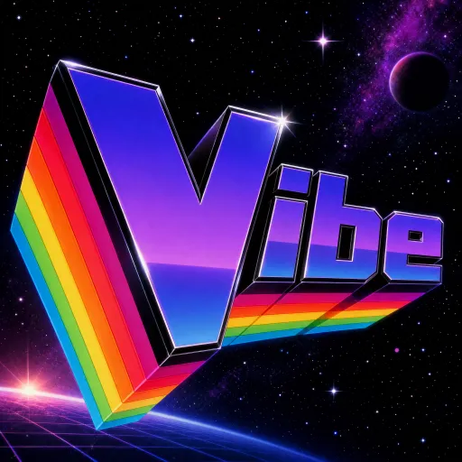

<p align="center">
  
</p>

# Vibe

[](https://github.com/mtanderson17/vibe/actions/workflows/ci.yml)

**A command center for agent-driven development.** Not another IDE with AI bolted on — a workspace built from the ground up to orchestrate many coding agents on one codebase.

Free forever, open source, works out of the box with FOSS models.

**Docs:** [Getting started](docs/getting-started.md) · [Concepts](docs/concepts.md) · [Configuration](docs/configuration.md) · [Architecture](docs/architecture.md) · [Troubleshooting](docs/troubleshooting.md) · [Backlog](BACKLOG.md)

## Why

Modern coding is drifting from "human writes code" to "human directs agents." Existing tools handle one agent at a time, in a chat sidebar next to an editor designed for solo humans. Vibe flips that: agents are the workflow, and the UI is a mission control for supervising them.

**Guiding principles:**

- **FOSS-first.** Vibe works with zero cost from day one — free-tier OpenRouter models or local Ollama. Bring paid keys when the task warrants it.
- **Command center, not IDE.** The human orchestrates. No tab-completion, no Copilot-style ghost text. Different tool for different work.
- **Isolation is free.** Each agent runs in its own git worktree on its own branch. No stepping on each other's files.
- **The human stays in control.** Every merge, every proposed task, every context update gets human review.

## Quick start (60 seconds)

Requires Node 20.19+ (or 22.12+) and Git 2.5+.

```bash
git clone https://github.com/mtanderson17/vibe.git
cd vibe
npm install
npm run dev
```

On first launch:
1. Paste an OpenRouter API key ([free signup, no card](https://openrouter.ai))
2. Click **Test free models** — Vibe probes which are currently live for your account and picks working ones
3. Pick a workspace folder (a git repo will be initialized if needed)
4. Click **Start**

Then in Control Center: **+ agent** → give it a task → watch it work.

**No key at all?** If you have [Ollama](https://ollama.com) installed with a tool-capable model (llama3.1, llama3.2, qwen2.5-coder), Vibe auto-detects it on setup. You can set the model to `ollama/<name>` and skip the API key.

## The three onboarding paths

| Path | Cost | Setup | Best for |
|---|---|---|---|
| **OpenRouter free** | $0 (50 req/day cap) | Paste one key | Trying Vibe out |
| **Local Ollama** | $0 (no cap) | Install Ollama, pull a model | Privacy, offline, unlimited use |
| **OpenRouter paid / BYO frontier key** | Real dollars | Same key + credit | Serious work, frontier quality |

## What ships today

**Core**
- Up to 8 concurrent agents, each in its own git worktree + branch
- Multi-turn conversation with agents (`ask_human` / `ask_human_choice`, follow-up during `awaiting_merge`)
- Kill/interrupt running agents
- Streaming responses
- Sibling awareness (agents know what other agents are working on)
- Per-agent model override; per-task model pinning (no mid-loop model chaos)
- `todo_write` / `todo_read` scratchpad so an agent keeps its own plan
- Context condensation — compacts old transcript past a token budget, keeping the cache-stable head intact
- Persisted agent state across restarts

**Provider stack**
- Vercel AI SDK adapters for OpenRouter, Anthropic, OpenAI, Gemini, Groq, xAI, and Ollama
- Fallback chains (`anthropic/claude-sonnet-4-6,openrouter/free`) with automatic failover
- On-startup probe: tests which free models actually work for your account
- Dynamic model catalogs from provider APIs
- Friendly error messages for common failures (rate limits, deprecated models, CUDA crashes)

**MCP**
- Connect Model Context Protocol servers from `.vibe/mcp.json`
- Their tools appear to agents as built-ins, namespaced `mcp_<server>_<tool>`

**AI-assisted merges**
- Merge conflict resolution agent with inline diff view (before/after per file, syntax-highlighted markers)
- Diff preview before merging
- File overlap warnings before merge (against sibling agent branches)

**Project management (PM) agent**
- Runs automatically after every merge to update `.vibe/context/summary.md`
- Proposes follow-up tasks based on observed changes (human accepts/dismisses)
- Chat with it directly from the Tasks screen
- Its own model chain, so summarization doesn't burn coding-model budget
- Its summary is injected into every agent's prompt — shared, current project state

**Safety and hygiene**
- API keys encrypted at rest via Electron `safeStorage` (Keychain / DPAPI / libsecret)
- Approval gate on dangerous shell commands (`rm -rf`, `git push`, `git reset --hard`)
- Auto-seeded workspace `.gitignore` (excludes secrets, `.vibe/worktrees/`, bytecode, deps)
- Auto-seeded workspace `.vibe/AGENTS.md` (per-project customization)

**UI**
- Sidebar nav: Control Center · Tasks · Files · Cost · Context · Settings
- Control Center grid: all agents at a glance, click any tile to focus
- Tasks kanban: Backlog / In Progress / Awaiting Merge / Done + Proposed row
- Files: Monaco editor over the workspace, lazy-loaded
- Cost: per-agent tokens and dollars from an append-only ledger that survives restarts
- Context tabs: Project (human-owned) | Summary (PM-maintained)
- Command palette (`Cmd/Ctrl+K`), customizable keybindings, project switcher

## Architecture

```
┌─────────────────────────────────────────────────┐
│  Renderer (React + Zustand)                     │
│  - Sidebar, Control Center, Agent panels        │
│  - Tasks kanban, Files, Cost, Context tabs      │
│  - Never touches disk or network directly       │
└─────────────────┬───────────────────────────────┘
                  │ IPC (contextBridge)
┌─────────────────▼───────────────────────────────┐
│  Electron main process                          │
│  - Agent lifecycle (spawn, kill, close)         │
│  - Git worktrees (create, merge, cleanup)       │
│  - Provider adapters + fallback chains          │
│  - MCP client (external tool servers)           │
│  - PM agent (post-merge summary + task propose) │
│  - Merge conflict resolver                      │
│  - Cost ledger, condenser, approval gate        │
│  - Persistence (.vibe/agents/*.json)            │
└─────────────────────────────────────────────────┘
```

Module-by-module detail, and the conventions worth keeping, are in
[docs/architecture.md](docs/architecture.md).

Each user workspace has:
```
your-project/
├── .git/
├── .gitignore              # seeded by Vibe on first init
├── src/, tests/, etc.      # your actual code
└── .vibe/
    ├── AGENTS.md           # per-project agent conventions
    ├── mcp.json            # MCP server definitions
    ├── context/
    │   ├── project.md      # human-owned project brief
    │   └── summary.md      # PM-maintained running state
    ├── tasks.json          # kanban backing store
    ├── agents/             # persisted agent state (chat, task, branch)
    └── worktrees/          # git worktrees per agent (gitignored)
```

## Development

```bash
npm run dev         # Electron dev with hot reload
npm run build       # Production build
npm run typecheck   # tsc across main + renderer
npm test            # Node's built-in test runner via tsx (258 tests)
npm run package     # installers into release/ (package:dir for unpacked)
npm run smoke       # launch the app and verify it starts
```

CI runs typecheck, tests and build on Linux, Windows and macOS for every push
and PR, plus a smoke job that packages the app and launches it on each.

## Known issues / rough edges

Being upfront about the state of the app while it's still stabilizing:

- **Small local models produce small-model results.** Free-tier and 3B Ollama models
  often mis-format tool calls, hallucinate URLs into binary files, or ignore
  AGENTS.md guidance. This is a model-quality floor, not a Vibe bug. BYOK Anthropic
  or a paid OpenRouter tier fixes it.
- **Sibling context refreshes on human re-engagement, not every turn.** Cost-
  conservative: the current agent sees fresh sibling state (plus fresh project
  summary and context) whenever you reply to it, but not on every internal loop
  turn. If a sibling starts/finishes mid-turn, the current agent won't notice
  until you re-engage. File-overlap warnings at merge time cover the practical
  worst case regardless.
- **UI polish is uneven.** Some screens (Control Center, Cost) are tight; others
  (Setup, Merge conflict banner) could use another pass.
- **Installers are unsigned.** They build for all three platforms, but macOS
  needs a right-click → Open the first time and Windows shows a SmartScreen
  warning. Signing certificates are the remaining half of [#66](BACKLOG.md);
  auto-update is [#73](BACKLOG.md).
- **No sandboxing on `run_bash`.** Agents can install packages globally,
  read/modify files outside the worktree via shell, etc. The approval gate
  catches a short list of dangerous patterns — it's a speed bump, not a
  boundary. Use a scratch workspace when testing. Container-per-agent isolation
  is [#68](BACKLOG.md).

## Security

**API keys** live in Electron's per-user data directory (`%APPDATA%\vibe\config.json` on Windows, `~/Library/Application Support/vibe/config.json` on macOS, `~/.config/vibe/config.json` on Linux) — outside the project folder, so they can't be committed. They're encrypted at rest via `safeStorage`: Keychain on macOS, DPAPI on Windows, kwallet/libsecret on Linux. On a Linux box with no keyring available it falls back to plain text; encrypted values are marked with an `enc:` prefix so you can tell which you have.

**Agents run unsandboxed.** `run_bash` executes arbitrary commands in the agent's worktree. Vibe blocks path escapes for `read_file`/`write_file`, and `approval.ts` pauses for your confirmation on a short list of dangerous patterns — but that gate doesn't catch subshells, `eval`, or a script the agent writes and then runs. Use a scratch workspace when trying tasks; don't point Vibe at folders with production secrets. Container-per-agent isolation is [#68](BACKLOG.md).

**What never gets committed:** the auto-seeded workspace `.gitignore` excludes `.env`, `*.pem`, `*.key`, common secret patterns, and `.vibe/worktrees/`. Review it before adding sensitive files.

## Roadmap

Planned work with the reasoning behind it lives in **[BACKLOG.md](BACKLOG.md)**,
kept in the repo so it survives between sessions. The short version:

**Next** — packaging and signed installers (#66) is the keystone; auto-update
(#73), onboarding (#74), launch-speed work (#75), and real install docs all
depend on it existing.

**After that** — container-per-agent sandboxing (#68), the data-science workflow
(#71), and the open design question of how optional heavyweight features should
plug in without a premature plugin API (#69).

**Longer term, not yet filed** — remote-dev over SSH, bring-your-own-compute,
automatic model routing (cheap for simple tasks, frontier for complex), agent
specialization (reviewer / test-writer / refactorer with pre-baked prompts),
and Agent Client Protocol support for orchestrating external CLIs alongside
native agents.

## Contributing

PRs welcome. Small changes: open a PR. Larger changes or new features: file an issue first so we can align on approach before you invest time.

Read [docs/architecture.md](docs/architecture.md) first — it covers the process
split, where things live, and two conventions that are easy to break by
accident (screens own state; zustand subscriptions stay narrow).

Before opening a PR:
```bash
npm test            # runs the whole suite
npm run typecheck   # verify types compile
npm run build       # verify production build
```

CI runs the same three across Linux, Windows, and macOS.

## License

MIT
